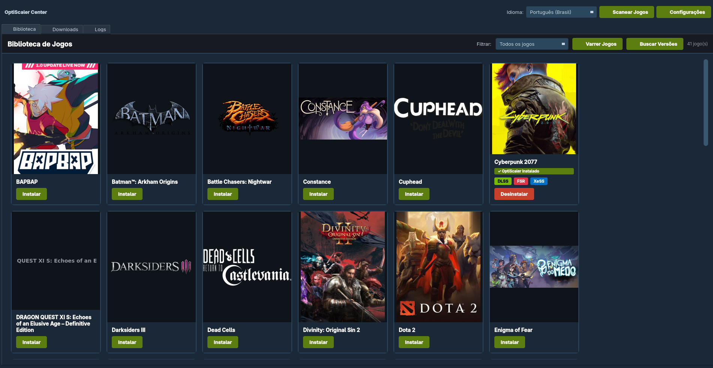

# 🎮 OptiScaler Center

<div align="center">


**Gerenciador visual para instalação e configuração do OptiScaler em jogos**

[Releases](https://github.com/JhonathanDomingues/OptiScaler-Center/releases) • [Reportar Bug](https://github.com/JhonathanDomingues/OptiScaler-Center/issues) • [Solicitar Feature](https://github.com/JhonathanDomingues/OptiScaler-Center/issues)

🌐 **[Read in English](README.en.md)**

</div>

---

## 📸 Interface



*Biblioteca de jogos com detecção automática Steam, cards visuais com capas e badges de tecnologia (DLSS, FSR, XeSS)*

---

## 📖 Sobre

**OptiScaler Center** é uma aplicação desktop multiplataforma que facilita o gerenciamento do [OptiScaler](https://github.com/optiscaler/OptiScaler) em seus jogos. Com uma interface moderna e intuitiva, você pode:

- 🔍 **Detectar automaticamente** jogos instalados no Steam
- 🎯 **Identificar DLLs suportadas** (DLSS, FSR, XeSS)
- 📥 **Baixar e instalar** diferentes versões do OptiScaler
- 💾 **Backup automático** de arquivos originais antes de qualquer instalação
- 🚀 **Suporte completo ao FSR4** com DLLs padrão e versões INT8
- ⚙️ **Configurações avançadas** de DLLs sem precisar modificar código
- 🧪 **Downloads de builds beta** via GitHub Actions

## ✨ Features Principais

### 🎮 Biblioteca de Jogos
- Detecção automática de bibliotecas Steam (Windows e Linux)
- Grade visual com capas carregadas diretamente da Steam
- Badges de tecnologia por jogo (DLSS / FSR / XeSS)
- Filtros por tecnologia e status de instalação
- Busca rápida por nome

### 📦 Downloads
- Versões estáveis via GitHub Releases
- **Builds beta** via GitHub Actions (requer token PAT)
- Gerenciamento de versões baixadas localmente

### 🛠️ FSR4 SDK
- Instala automaticamente as **3 DLLs padrão** do FSR4
- Opção de substituir o upscaler por versão **INT8** (menor uso de memória)
- Versões INT8 disponíveis: **4.0.1**, **4.0.2c** (e futuras)
- Suporte para substituir qualquer DLL padrão por versão externa (via Configurações)

### ⚙️ Configurações
- Troca de idioma (Português / English) em tempo real
- Configuração de token GitHub para downloads beta
- Gerenciamento de DLLs FSR4 (padrão e INT8) sem modificar código

---

## 🚀 Início Rápido

### 📦 Download (Binários Prontos)

Baixe a versão mais recente na [página de releases](https://github.com/JhonathanDomingues/OptiScaler-Center/releases):

#### Linux (AppImage) — Recomendado 🚀
```bash
chmod +x OptiScalerCenter-Linux-v0.1.6.AppImage
./OptiScalerCenter-Linux-v0.1.6.AppImage
```
Não requer instalação. Funciona em qualquer distribuição Linux.

#### Linux (TAR.GZ)
```bash
tar -xzf OptiScalerCenter-Linux-v0.1.6.tar.gz
./OptiScalerCenter/OptiScalerCenter
```

#### Windows
1. Baixe `OptiScalerCenter-Windows-v0.1.6.zip`
2. Extraia e execute `OptiScalerCenter.exe`

---

## ⚙️ Como Configurar

### 1. Primeira Execução

Ao abrir o aplicativo, clique em **"Varrer Jogos"** para detectar automaticamente sua biblioteca Steam. Os jogos aparecerão como cards com capa e badges indicando DLSS, FSR ou XeSS.

### 2. Baixar o OptiScaler

Acesse a aba **Downloads** e clique em **"Buscar Versões"** para listar as releases disponíveis. Clique em **"Baixar"** na versão desejada.

> Para baixar **builds beta**, configure primeiro um token GitHub (ver passo 4).

### 3. Instalar em um Jogo

Na aba **Biblioteca**, clique em **"Instalar"** no card do jogo desejado. O diálogo de instalação permite:

| Opção | Descrição |
|---|---|
| **Versão** | Escolha a versão do OptiScaler já baixada |
| **Loader DLL** | DLL de entrada (padrão: `dxgi.dll`; use `winmm.dll` para jogos UE4/UE5) |
| **FSR4 SDK** | Instala as 3 DLLs padrão do FSR4 junto com o OptiScaler |
| **Versão INT8** | Substitui o upscaler FSR4 por versão INT8 (4.0.1, 4.0.2c…) |

Um **backup automático** dos arquivos originais é criado antes de qualquer modificação.

### 4. Configurações (botão ⚙️ no canto superior direito)

#### Aba Geral
- **Idioma**: Alterna entre Português (Brasil) e English instantaneamente.

#### Aba GitHub
- **Repositório estável**: URL base para releases (`JhonathanDomingues/OptiScaler-Center`)
- **Token de acesso (PAT)**: Necessário para baixar builds beta via GitHub Actions.
  - Gere em: GitHub → Settings → Developer Settings → Personal Access Tokens → Fine-grained tokens
  - Permissão necessária: `Actions: Read` e `Contents: Read`
- **Mostrar betas**: Ativa a seção de betas na aba Downloads
- **Repositório / Workflow / Padrão de branch**: Configura de onde buscar os betas

#### Aba FSR4 SDK
- **DLLs Padrão**: Tabela com as 3 DLLs bundled. Clique em **"Substituir…"** para usar uma DLL externa (útil quando a AMD lança atualizações). Clique em **"Restaurar"** para voltar à versão embutida.
- **Versões INT8**: Lista todas as versões INT8 disponíveis. Clique em **"Adicionar versão INT8"** para importar uma DLL externa e **"Remover selecionada"** para excluir versões personalizadas.

### 5. Desinstalar

Clique em **"Desinstalar"** no card do jogo (disponível somente quando o OptiScaler está instalado). Os arquivos originais são restaurados automaticamente a partir do backup.

---

## 🔧 Instalação para Desenvolvimento

```bash
# Clone o repositório
git clone https://github.com/JhonathanDomingues/OptiScaler-Center.git
cd OptiScaler-Center

# Instale as dependências
pip install -r requirements.txt

# Execute a aplicação
python src/main.py
```

### 🏗️ Compilar Executáveis

#### Linux
```bash
./build.sh           # Gera o executável
./build-appimage.sh  # Gera o AppImage (requer build.sh primeiro)
```

#### Windows
```cmd
build.bat
```

---

## 🏗️ Arquitetura

O projeto segue os princípios de **Clean Architecture**:

```
┌─────────────────────┐
│  Presentation UI    │  ← PyQt6 Interface
├─────────────────────┤
│  Application Layer  │  ← Use Cases & Services
├─────────────────────┤
│  Domain Layer       │  ← Entities & Business Logic
├─────────────────────┤
│  Infrastructure     │  ← Steam, GitHub, FileSystem
└─────────────────────┘
```

```
OptiScaler-Center/
├── src/
│   ├── presentation/      # Interface PyQt6 (widgets, diálogos)
│   ├── application/       # Casos de uso (instalar, baixar, scan)
│   ├── domain/           # Entidades e lógica de negócio
│   ├── infrastructure/   # Steam, GitHub, filesystem, config
│   └── utils/           # i18n, logger, constantes
├── resources/
│   ├── fsr4_sdk/
│   │   ├── standard/     # 3 DLLs FSR4 padrão
│   │   └── int8/         # DLLs INT8 versionadas (4.0.1, 4.0.2c…)
│   └── locales/          # Traduções (pt_BR.json, en.json)
├── data/                 # Config YAML, banco SQLite, backups
└── tests/                # Testes automatizados
```

## 🛠️ Tecnologias

- **Python 3.10+** — Linguagem principal
- **PyQt6** — Framework de interface gráfica
- **SQLite** — Banco de dados local
- **aiohttp** — Downloads assíncronos
- **vdf** — Parser de arquivos Steam (bibliotecas e configurações)
- **requests** — Integração com GitHub API
- **PyInstaller** — Empacotamento em executável

## 🗺️ Roadmap

### ✅ Concluído (v0.1.6)
- [x] Scanner de jogos Steam (Windows e Linux)
- [x] Interface moderna com cards estilo Steam
- [x] Download de versões estáveis e betas do GitHub
- [x] Instalação/desinstalação com backup automático
- [x] Suporte FSR4 SDK (DLLs padrão + INT8 versionado)
- [x] Diálogo de Configurações (idioma, GitHub, FSR4)
- [x] Substituição individual de DLLs padrão sem modificar código
- [x] i18n completo (PT-BR / EN) funcionando no AppImage
- [x] Detecção de pastas UE4/UE5

### 🔄 Em Desenvolvimento
- [ ] Perfis de configuração por jogo
- [ ] Atualização em lote de múltiplos jogos
- [ ] Filtros avançados de busca

### 🔮 Planejado
- [ ] Integração Epic / GOG / EA / Ubisoft
- [ ] Auto-update da aplicação
- [ ] Cloud sync de configurações
- [ ] Modo portátil

## 🤝 Contribuindo

1. 🍴 Fork o projeto
2. 🔨 Crie uma branch (`git checkout -b feature/MinhaFeature`)
3. ✅ Commit suas mudanças (`git commit -m 'feat: descrição'`)
4. 📤 Push para a branch (`git push origin feature/MinhaFeature`)
5. 🎉 Abra um Pull Request

## 🐛 Reportar Bugs

[Abra uma issue](https://github.com/JhonathanDomingues/OptiScaler-Center/issues) com:
- Descrição clara do problema e passos para reproduzir
- Versão do aplicativo e sistema operacional
- Conteúdo do arquivo de log em `~/.local/share/optiscaler-center/logs/` (Linux) ou `%APPDATA%\optiscaler-center\logs\` (Windows)

## 📜 Licença

Este projeto está sob a licença MIT. Veja o arquivo [LICENSE](LICENSE) para mais detalhes.

## 🙏 Agradecimentos

- [OptiScaler](https://github.com/optiscaler/OptiScaler) — Pelo projeto incrível
- [AMD FidelityFX](https://gpuopen.com/fidelityfx/) — Pelo FSR4 SDK

---

<div align="center">

**Feito para a comunidade de gamers**

[⬆ Voltar ao topo](#-optiscaler-center)

</div>
